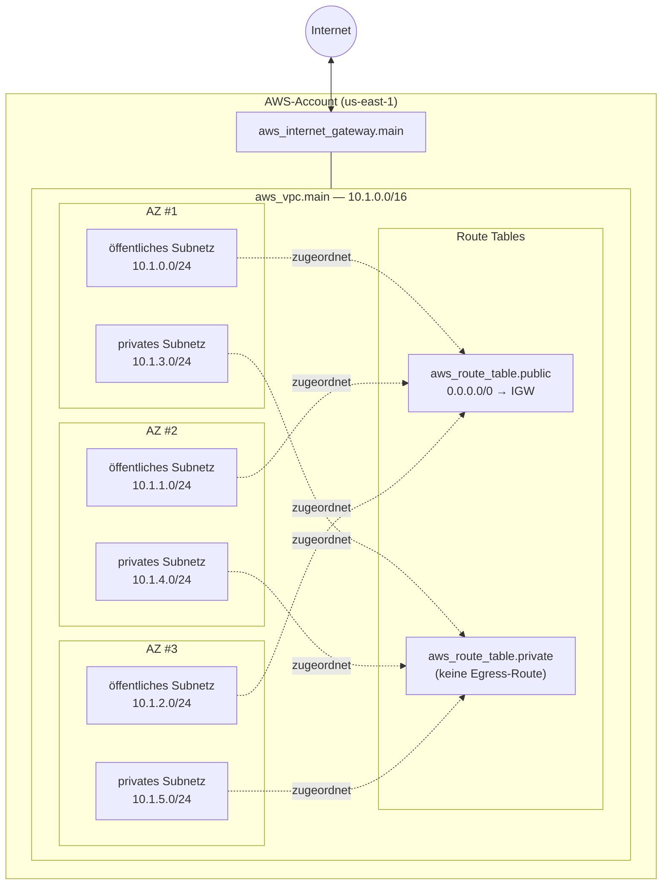
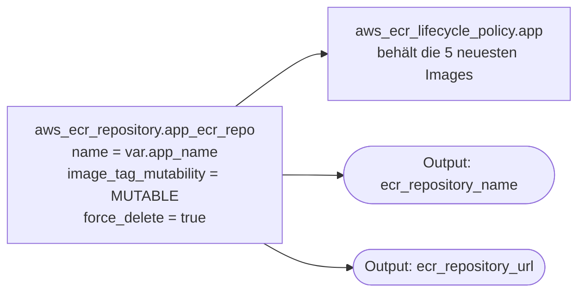
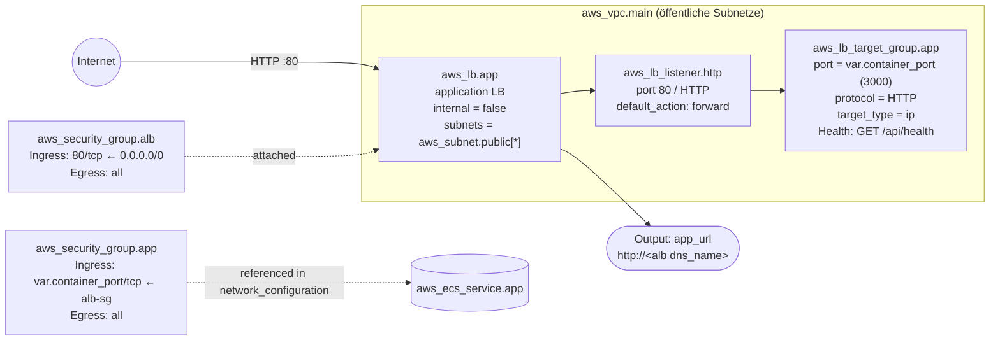
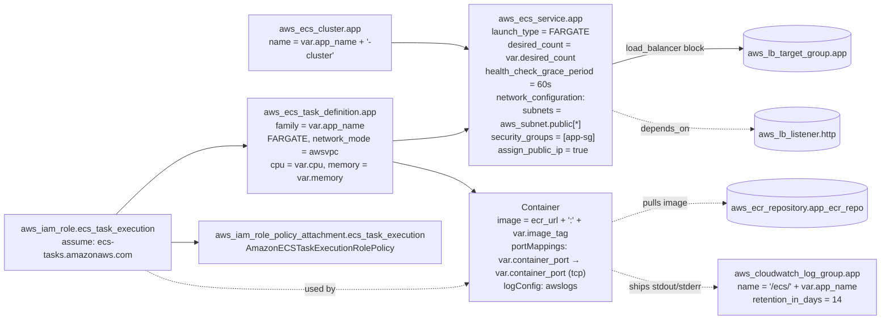
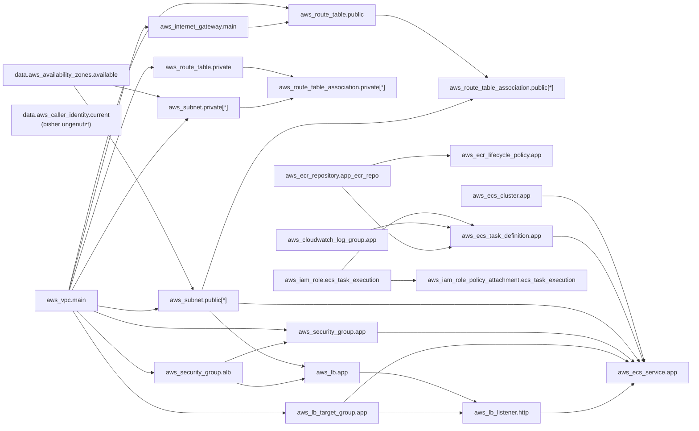
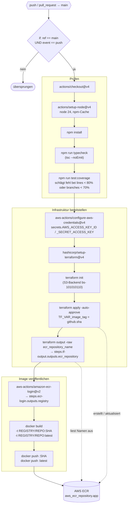

# Terraform-Infrastruktur

Dokumentation der AWS-Ressourcen, die aktuell von `terraform/` verwaltet werden.
Der State liegt remote im S3-Bucket `bs-101010110` (Key `terraform.tfstate`, Region `us-east-1`).

## Netzwerkarchitektur

VPC `10.1.0.0/16`, verteilt über die ersten drei Availability Zones der konfigurierten Region (Default `us-east-1`). Jede AZ erhält je ein öffentliches und ein privates `/24`-Subnetz. Öffentliche Subnetze routen `0.0.0.0/0` über ein Internet Gateway; private Subnetze haben aktuell keinen Egress (kein NAT Gateway).

> Die CIDRs werden mit `cidrsubnet(var.vpc_cidr, 8, i)` berechnet — öffentlich nutzt die Indizes 0–2, privat die Indizes 3–5.

## Container Registry

Eine einzelne ECR-Repository, benannt nach `var.app_name` (Default `quiz-app`), mit veränderbaren Tags und einer Lifecycle Policy, die nur die fünf neuesten Images behält.

## Load Balancer und Security Groups

Ein öffentlich erreichbarer Application Load Balancer in den drei öffentlichen Subnetzen terminiert HTTP auf Port 80 und leitet an eine IP-basierte Target Group weiter, die direkt die ENIs der Fargate-Tasks adressiert. Zwei Security Groups bilden eine Zwei-Schichten-Trennung: Der ALB nimmt Traffic aus dem Internet an, die App-SG akzeptiert nur Verkehr vom ALB auf dem Container-Port.

## Compute (ECS / Fargate)

Die Anwendung läuft als Fargate-Service in einem dedizierten ECS-Cluster. Tasks werden in die **öffentlichen** Subnetze platziert und bekommen eine öffentliche IP (`assign_public_ip = true`) — das ersetzt das fehlende NAT Gateway, damit ECR-Pulls und Container-Logs nach außen funktionieren. Die Verbindung zwischen Service und ALB erfolgt über die Target Group; der Service wartet bis zum Listener (`depends_on = aws_lb_listener.http`), bevor er Tasks registriert.

> Architektur-Hinweis: Da keine NAT vorhanden ist und die Tasks öffentliche IPs erhalten, müssen sie zwingend in `aws_subnet.public` laufen — andernfalls würde der ECR-Pull beim Task-Start fehlschlagen.

## Abhängigkeitsgraph der Ressourcen

So referenzieren sich die Ressourcen gegenseitig (implizite Terraform-Abhängigkeiten).

## Variablen

| Name | Typ | Default | Verwendet von |
|---|---|---|---|
| `aws_region` | string | `us-east-1` | Provider, `awslogs-region` der Task Definition |
| `app_name` | string | `quiz-app` | Tags, VPC-/Subnetz-/RT-/SG-Namen, ECR-Repo-Name, ECS-Cluster-/Service-/TaskDef-Namen, ALB-/TG-Namen, Log-Group-Name |
| `vpc_cidr` | string | `10.0.0.0/16` | VPC + Ableitung der Subnetz-CIDRs |
| `image_tag` | string | `latest` | Container-Image-Tag in der Task Definition |
| `container_port` | number | `3000` | App-SG-Ingress, `portMappings` der Task Definition, Target-Group-Port |
| `cpu` | number | `256` | Fargate-Task `cpu` |
| `memory` | number | `512` | Fargate-Task `memory` |
| `desired_count` | number | `1` | ECS-Service `desired_count` |

## Outputs

| Name | Quelle | Konsumiert von |
|---|---|---|
| `ecr_repository_name` | `aws_ecr_repository.app_ecr_repo.name` | `.github/workflows/ci-cd.yml` (Docker-Tag) |
| `ecr_repository_url` | `aws_ecr_repository.app_ecr_repo.repository_url` | — |
| `app_url` | `"http://${aws_lb.app.dns_name}"` | manuelle/operative Nutzung (öffentliche App-URL) |

## CI/CD-Pipeline

GitHub-Actions-Workflow unter `.github/workflows/ci-cd.yml`. Wird durch Push oder Pull Request auf `main` getriggert, der Job `build-and-deploy` läuft jedoch aktuell nur bei einem direkten Push auf `main` (`if: github.ref == 'refs/heads/main' && github.event_name == 'push'`).

> Hinweise:
> - `var.image_tag` fließt jetzt in `aws_ecs_task_definition.app` ein (`image = "...:${var.image_tag}"`); allerdings setzt der aktuelle Workflow `TF_VAR_image_tag` nicht mehr explizit, so dass beim Apply der Default `latest` greift.
> - Der Tag `latest` wird bei jedem Push überschrieben; der SHA-Tag ist der unveränderliche Bezug.
> - Die Lifecycle Policy auf der ECR-Repo entfernt alles über die 5 neuesten Images hinaus.
> - Der Workflow forciert kein neues ECS-Deployment nach dem Image-Push — der Service zieht erst dann eine neue Image-Version, wenn die Task Definition (z. B. via `image_tag`) geändert oder ein `force-new-deployment` ausgelöst wird.

## Dateien

| Datei | Inhalt |
|---|---|
| `main.tf` | terraform-Block, S3-Backend, AWS-Provider, `aws_caller_identity`-Data |
| `variables.tf` | Definitionen der Input-Variablen |
| `vpc.tf` | VPC, IGW, öffentliche/private Subnetze, Route Tables, Associations |
| `networking.tf` | ALB-/App-Security-Groups, Application Load Balancer, Target Group, HTTP-Listener |
| `ecr.tf` | ECR-Repository + Lifecycle Policy |
| `ecs.tf` | ECS-Cluster, Task-Execution-Role (+ Attachment), CloudWatch Log Group, Task Definition, Fargate-Service |
| `outputs.tf` | Terraform-Outputs |
