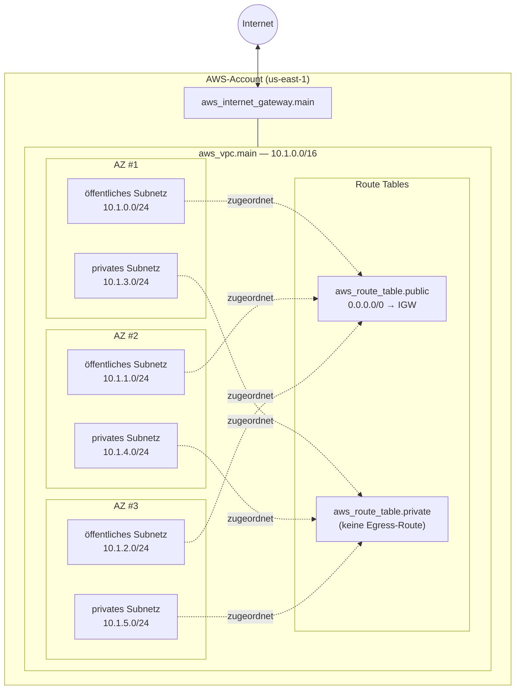
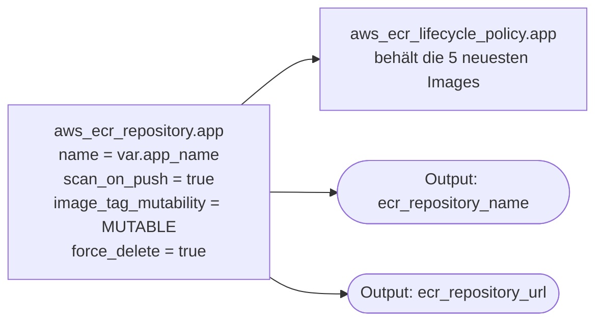
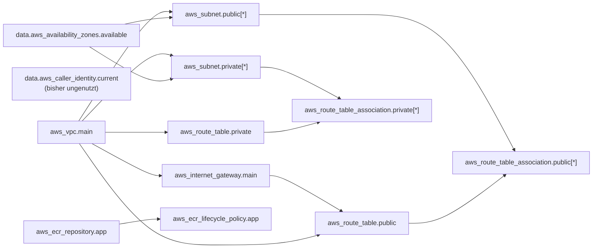

# Terraform-Infrastruktur

Dokumentation der AWS-Ressourcen, die aktuell von `terraform/` verwaltet werden.
Der State liegt remote im S3-Bucket `bs-101010110` (Key `terraform.tfstate`, Region `us-east-1`).

## Netzwerkarchitektur

VPC `10.1.0.0/16`, verteilt über die ersten drei Availability Zones der konfigurierten Region (Default `us-east-1`). Jede AZ erhält je ein öffentliches und ein privates `/24`-Subnetz. Öffentliche Subnetze routen `0.0.0.0/0` über ein Internet Gateway; private Subnetze haben aktuell keinen Egress (kein NAT Gateway).

> Die CIDRs werden mit `cidrsubnet(var.vpc_cidr, 8, i)` berechnet — öffentlich nutzt die Indizes 0–2, privat die Indizes 3–5.

## Container Registry

Eine einzelne ECR-Repository, benannt nach `var.app_name` (Default `quiz-app`), mit Image-Scanning beim Push, veränderbaren Tags und einer Lifecycle Policy, die nur die fünf neuesten Images behält.

## Abhängigkeitsgraph der Ressourcen

So referenzieren sich die Ressourcen gegenseitig (implizite Terraform-Abhängigkeiten).

## Variablen

| Name | Typ | Default | Verwendet von |
|---|---|---|---|
| `aws_region` | string | `us-east-1` | Provider |
| `app_name` | string | `quiz-app` | Tags, VPC-/Subnetz-/RT-Namen, ECR-Repo-Name |
| `vpc_cidr` | string | `10.1.0.0/16` | VPC + Ableitung der Subnetz-CIDRs |
| `image_tag` | string | `latest` | _deklariert, aber aktuell ungenutzt_ |
| `container_port` | number | `3000` | _deklariert, aber aktuell ungenutzt_ |
| `cpu` | number | `256` | _deklariert, aber aktuell ungenutzt_ |
| `memory` | number | `512` | _deklariert, aber aktuell ungenutzt_ |
| `desired_count` | number | `1` | _deklariert, aber aktuell ungenutzt_ |

## Outputs

| Name | Quelle | Konsumiert von |
|---|---|---|
| `ecr_repository_name` | `aws_ecr_repository.app.name` | `.github/workflows/ci-cd.yml` (Docker-Tag) |
| `ecr_repository_url` | `aws_ecr_repository.app.repository_url` | — |

## CI/CD-Pipeline

GitHub-Actions-Workflow unter `.github/workflows/ci-cd.yml`. Wird durch Push oder Pull Request auf `main` getriggert, der Job `build-and-deploy` läuft jedoch aktuell nur bei einem direkten Push auf `main` (`if: github.ref == 'refs/heads/main' && github.event_name == 'push'`).

> Hinweise:
> - `TF_VAR_image_tag` wird an `terraform apply` übergeben, aber bisher referenziert keine Terraform-Ressource `var.image_tag` — also ohne Wirkung, bis eine ECS Task Definition hinzukommt.
> - Der Tag `latest` wird bei jedem Push überschrieben; der SHA-Tag ist der unveränderliche Bezug.
> - Die Lifecycle Policy auf der ECR-Repo entfernt alles über die 5 neuesten Images hinaus.

## Dateien

| Datei | Inhalt |
|---|---|
| `main.tf` | terraform-Block, S3-Backend, AWS-Provider, `aws_caller_identity`-Data |
| `variables.tf` | Definitionen der Input-Variablen |
| `vpc.tf` | VPC, IGW, öffentliche/private Subnetze, Route Tables, Associations |
| `ecr.tf` | ECR-Repository + Lifecycle Policy |
| `outputs.tf` | Terraform-Outputs |
