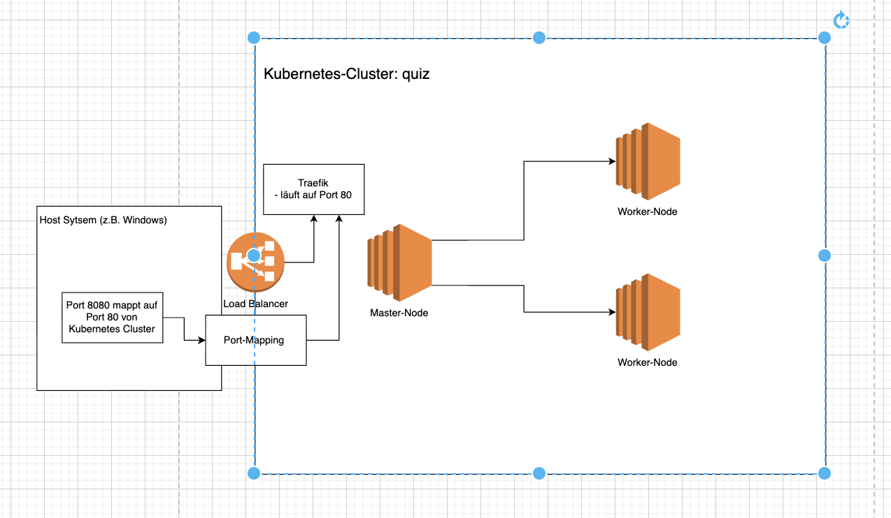

# K3D - Lightweight Kubernetes Tutorial

## 1. Schritt Kubernetes-Cluster erstellen



- Unser Ziel, ist es, wie im Bild zu sehen, das grundlegende Cluster erstmal zu erstellen
- Cluster werden genutzt, um voneinander getrennte Umgebungen zu erstellen (z.B. PROD + DEV)

```bash
k3d cluster create quiz --port "8080:80@loadbalancer" --agents 2
```

- `k3d`: Kubernetes Programm
- `cluster`: Wir möchten den "Service" cluster ansprechen
- `create`: Die Aktion `create ausführen`
- `--port`: Port `8080` von unserer Maschine auf den Port 80 von dem Cluster mappen wollen (da läuft der Loadbalancer)
- `--agents 2`: Fügt 2 worker nodes hinzu

### Überprüft, dass alles geklappt hat:

- Docker container überprüfen (sollte so aussehen):
  
- `kubectl get nodes` sollten folgendes ergeben:

```bash
NAME                STATUS   ROLES                  AGE   VERSION
k3d-quiz-agent-0    Ready    <none>                 76s   v1.33.6+k3s1
k3d-quiz-agent-1    Ready    <none>                 76s   v1.33.6+k3s1
k3d-quiz-server-0   Ready    control-plane,master   79s   v1.33.6+k3s1
```

- `kubectl config get-contexts`zeigt euch den aktuelln und weitere Kontexte an (\* markiert den aktuell ausgwählten)
- `kubectl config use-context <conext-name>` könnt diesen wechsel

- Folgender Befehl zigt alle Pods an, auch die, die von k3d mitkonfiguriert wurden

```bash
kubectl get pods --all-namespaces
```

## 2. Schritt (Kennen wir schon)

- Image, welches wir deployen möchten builden: `docker build -t quiz-app:local .`
- Bei lokaeln images, muss man die images erst in den Kontext laden: `k3d image import quiz-app:local -c quiz`
  - `-c`: Kontext

## 3. Schritt

- Voraussetzung: Ihr habt den Ordner [k3d](./k3d/) in euer repository kopiert
- Um eine Unterteilung von Apps (z.B. zwischen Teams zu machen) nutzen wir namespaces
- Vorhandene namespaces auflisten: `kubectl get namespaces`
- `kubectl apply -f k3d/namespace.yml `
  - Allgemein: `kubectl apply -f <Datei-Pfad>`, dabei bezieht sich der Dateipfad auf die Konfiguration, die angewendet werden soll

# 4. Schritt

Jetzt möchten wir unsere App mit der Konfiguration deployen und dem hinterlegtem image.
Die Konfiguration findet ihr in der bereits kopierten [Datei](./k3d/quiz-app.yml)
Dazu gehört:

- `kind: Deployment`: Referenziert das Docker image und die replicas, die deployed werden sollen
- `kind: Service`: Gibt dem Master Node mit, wo die App läuft und kümmert sich ums Port Mapping

- Aufgabe:
- `kubectl get pods -n quiz`: Überprüfen, dass keine pods vorhanden sind
- `kubectl get services -n quiz`: Überprüfen, dass keine services vorhanden sind
- `kubectl get deployments -n quiz`: Überprüfen, dass keine deployments vorhanden sind
- Service und Deployment hinzufügen mit: `kubectl apply -f k3d/quiz-app.yml`
- `kubectl get pods -n quiz`: Überprüfen, dass pods vorhanden sind
- `kubectl get services -n quiz`: Überprüfen, dass services vorhanden sind
- `kubectl get deployments -n quiz`: Überprüfen, dass deployments vorhanden sind

## 5. Schritt: Ingress Regeln anpassen

- Ingress Regeln bestimmen das Routing
- `kubectl apply -f k3d/ingress.yml`
